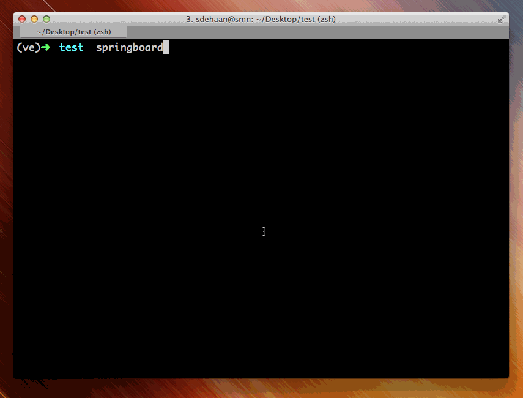

Springboard
===========

.. image:: https://travis-ci.org/universalcore/springboard.svg?branch=develop
    :target: https://travis-ci.org/universalcore/springboard
    :alt: Continuous Integration

.. image:: https://coveralls.io/repos/universalcore/springboard/badge.png?branch=develop
    :target: https://coveralls.io/r/universalcore/springboard?branch=develop
    :alt: Code Coverage

.. image:: https://readthedocs.org/projects/springboard/badge/?version=latest
    :target: https://springboard.readthedocs.org
    :alt: Springboard Documentation

.. image:: https://pypip.in/version/springboard/badge.svg
    :target: https://pypi.python.org/pypi/springboard
    :alt: Pypi Package

Usage
~~~~~

Make sure elasticsearch_ is running, then::

    $ pip install springboard
    $ springboard startapp myapp
    $ cd myapp
    $ springboard import git://example.com/content/repo.git -v
    $ pserve development.ini --reload

    Starting server in PID 70411.
    serving on http://0.0.0.0:6543

Installing for local dev
~~~~~~~~~~~~~~~~~~~~~~~~

Make sure elasticsearch_ is running, then::

    $ git clone https://github.com/universalcore/springboard.git
    $ cd springboard
    $ virtualenv ve
    $ source ve/bin/activate
    (ve)$ pip install -e .
    (ve)$ springboard bootstrap -v
    (ve)$ pserve development.ini --reload

.. _elasticsearch: http://www.elasticsearch.org
